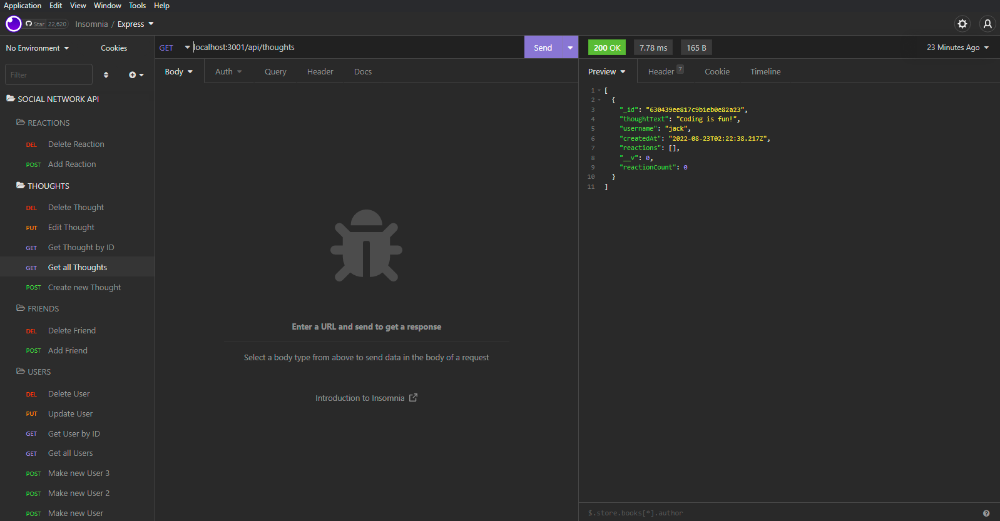

# Social-Network-API
Module 18 Challenge by Sergey Holin

GitHub Repo Link: https://github.com/sergeyholin/Social-Network-API

Live Demo Link: https://drive.google.com/file/d/1J3NEyGaVK-Qx30cdtAcmtPIH_KE8_yKl/view

## ABOUT THE APP:

This application is a back-end for a social network web application where users can share their thoughts, react to friends’ thoughts, and create a friend list.

## Acceptance Criteria

```md
GIVEN a social network API
WHEN I enter the command to invoke the application
THEN my server is started and the Mongoose models are synced to the MongoDB database
WHEN I open API GET routes in Insomnia for users and thoughts
THEN the data for each of these routes is displayed in a formatted JSON
WHEN I test API POST, PUT, and DELETE routes in Insomnia
THEN I am able to successfully create, update, and delete users and thoughts in my database
WHEN I test API POST and DELETE routes in Insomnia
THEN I am able to successfully create and delete reactions to thoughts and add and remove friends to a user’s friend list
```
## TECHNOLOGIES USED: 
Insomnia,
NODE.js,
MongoDB,
NPM Modules: express, mongoose, nodemon.

## SCREENSHOT:

